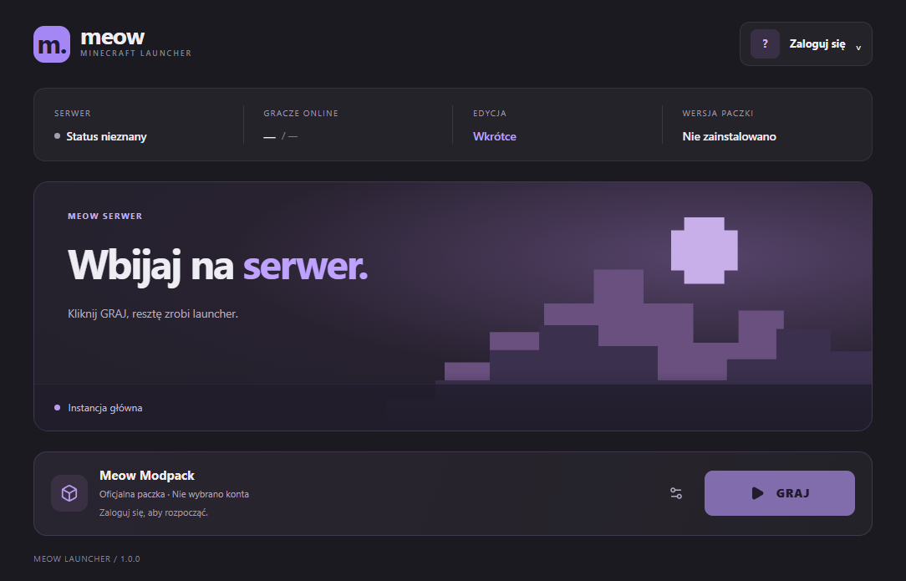
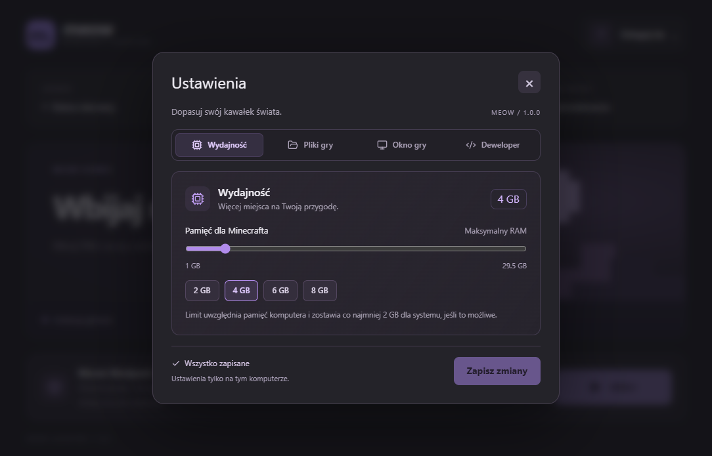

<div align="center">


# Meow Launcher

**Mały launcher. Wielka przygoda.**

Desktopowy launcher Minecraft Java Edition zbudowany pod jeden modpack i jeden serwer.<br />
Zamiast uniwersalnej platformy pokroju Prism Launchera: jeden przycisk **GRAJ**, który po prostu działa.

[](https://www.electronjs.org/)
[](https://react.dev/)
[](https://www.typescriptlang.org/)
[](https://electron-vite.org/)
[](#)
[](#-roadmapa)



</div>

---

## Spis treści

- [Funkcje](#-funkcje)
- [Szybki start](#-szybki-start)
- [Logowanie Microsoft](#-logowanie-microsoft)
- [Jak to działa](#-jak-to-działa)
- [Architektura](#-architektura)
- [Bezpieczeństwo](#-bezpieczeństwo)
- [Tryb deweloperski](#-tryb-deweloperski)
- [Testy](#-testy)
- [Roadmapa](#-roadmapa)

## ✨ Funkcje

- 🎮 **Jedno kliknięcie do gry** — launcher sam instaluje Minecrafta, biblioteki, assets i loader, a potem uruchamia grę.
- ☕ **Zarządzana Java** — pobiera Eclipse Temurin do katalogu instancji. Nie trzeba instalować Javy systemowo.
- 🧩 **Loadery** — Vanilla, Fabric, Forge i NeoForge (instalacja przez [XMCL](https://github.com/Voxelum/minecraft-launcher-core-node)).
- 🔐 **Konto Microsoft** — logowanie przez przeglądarkę systemową (MSAL + PKCE), odświeżanie sesji i wylogowanie.
- 👤 **Profil offline** — gra po samym nicku z poprawnym offline UUID.
- ✅ **Weryfikacja plików** — pobieranie do `.tmp`, sumy kontrolne, timeout i retry.
- ⚙️ **Ustawienia** — RAM dopasowany do pamięci komputera, rozmiar okna / pełny ekran, folder instalacji.
- 📊 **Postęp na żywo** — stan instalacji i procesu gry przesyłany z Main do UI.
- 📝 **Logi** — logi launchera i filtrowany strumień gry, bez tokenów i danych logowania.

<details>
<summary><b>Zobacz ustawienia</b></summary>
<br />

</details>

## 🚀 Szybki start

**Wymagania:** Node.js **22.12+**, npm, Windows x64.

```sh
git clone https://github.com/luki2428/Meow-Launcher.git
cd Meow-Launcher
npm ci
npm run dev
```

Dodaj profil offline (lub [skonfiguruj Microsoft](#-logowanie-microsoft)), wybierz konto i kliknij **GRAJ**. Domyślna instancja to vanilla Minecraft **1.21.1** z Javą **21**.

### Skrypty

| Komenda                | Opis                                        |
| ---------------------- | ------------------------------------------- |
| `npm run dev`          | Tryb deweloperski z HMR                     |
| `npm run build`        | Typecheck + build produkcyjny do `out/`     |
| `npm run build:win`    | Instalator NSIS dla Windows                 |
| `npm run build:unpack` | Build bez instalatora (`dist/win-unpacked`) |
| `npm start`            | Podgląd zbudowanej aplikacji                |
| `npm run typecheck`    | TypeScript dla Main/Preload i Renderera     |
| `npm run lint`         | ESLint                                      |
| `npm run format`       | Prettier                                    |
| `npm test`             | Testy jednostkowe (`node:test`)             |

## 🔐 Logowanie Microsoft

Skopiuj `.env.example` do `.env` i wpisz **publiczny** Application (client) ID:

```dotenv
MICROSOFT_CLIENT_ID=
```

- Nie wpisuj Client Secret — launcher jest publicznym klientem.
- Rejestracja aplikacji w Entra ID musi obsługiwać konta osobiste i przekierowanie `http://localhost`.
- Client ID musi mieć dostęp do usług Xbox / Minecraft — dowolna rejestracja go nie gwarantuje.
- Scopes: `XboxLive.signin`, `offline_access`.
- Client ID trafia wyłącznie do procesu Main. Zmienna środowiskowa przy starcie ma pierwszeństwo nad `.env`. Po zmianie uruchom ponownie `dev` / `build`.

```text
MSAL OAuth ──► Xbox Live ──► XSTS ──► Minecraft Services ──► profil Java
```

Sesja jest sprawdzana ponownie przed instalacją i tuż przed startem gry. Konto bez profilu Minecraft Java Edition nie zostanie dodane.

Dokumentacja: [MSAL Node — publiczny klient](https://learn.microsoft.com/en-us/entra/msal/javascript/node/initialize-public-client-application) · [przykład Electron](https://learn.microsoft.com/en-us/entra/identity-platform/tutorial-v2-nodejs-desktop)

> [!NOTE]
> Profil offline nie uwierzytelnia gracza i nie wpuści go na serwer z `online-mode=true`.

## ⚙️ Jak to działa

Po kliknięciu **GRAJ** proces Main:

1. blokuje drugi start i waliduje konfigurację, konto oraz RAM,
2. przygotowuje Javę instancji (Temurin, weryfikacja SHA-256, rozmiaru i `java -version`),
3. instaluje / sprawdza klienta, biblioteki i assets przez XMCL,
4. instaluje loader — Forge i NeoForge używają tej samej Javy do postprocesorów,
5. odświeża sesję, przygotowuje natives i argumenty, uruchamia `java.exe` **bez shella**,
6. monitoruje PID, stdout/stderr i kod wyjścia, raportując stan do Reacta.

Zamknięcie okna w trakcie gry nie zabija Minecrafta — Main działa do końca procesu, a ponowne otwarcie pokazuje to samo uruchomienie.

### Dane na dysku

```text
app.getPath('userData')/
├── settings.json              # RAM, okno gry, metadane kont, wybrane konto
├── sessions.json              # zaszyfrowany cache MSAL (safeStorage)
├── logs/                      # logi launchera
└── instances/                 # domyślny folder instalacji (zmienialny w ustawieniach)
    ├── main/
    │   ├── instance.json      # wersja gry, Javy i loadera
    │   ├── runtime/java/      # prywatny runtime Temurin
    │   └── game/              # versions, libraries, assets, saves, config…
    └── developer/             # osobna instancja trybu deweloperskiego
```

Folder instalacji można zmienić w **Ustawienia → Pliki gry**. Launcher nie nadpisuje światów, screenshotów, `options.txt` ani ustawień modów.

### Konfiguracja instancji

`instance.json` powstaje przy pierwszym uruchomieniu i można go edytować przy zamkniętej grze:

```json
{
  "id": "main",
  "minecraft": "1.21.1",
  "java": { "majorVersion": 21, "architecture": "x64" },
  "loader": { "type": "neoforge", "version": "21.1.251" },
  "playEnabled": true
}
```

`loader.type`: `vanilla` · `fabric` · `forge` · `neoforge`. Wersje gry, Javy i loadera muszą być ze sobą zgodne. Walidacja Zod odrzuca nieznane pola, ścieżki do plików wykonywalnych i dowolne argumenty JVM.

## 🏗️ Architektura

Klasyczny podział Electron — logika systemowa w Main, React wyłącznie jako UI.

```text
src/
├── main/                  # proces główny (Node)
│   ├── auth/              # konta, Microsoft, szyfrowany cache sesji
│   ├── java/              # wykrywanie i instalacja runtime Temurin
│   ├── minecraft/         # instancja, instalacja, adapter XMCL, proces gry
│   ├── services/          # ustawienia, profil offline, tryb deweloperski
│   ├── ipc/               # handlery IPC z walidacją nadawcy
│   └── shared/            # LauncherError, walidacja, sieć
├── preload/               # contextBridge → window.launcher
├── renderer/src/          # React: pages, components, hooks, styles
└── shared/                # typy i kontrakty IPC wspólne dla procesów
```

Biblioteka launcher-core (`@xmcl/*`) jest schowana za adapterem [`MinecraftLauncherAdapter`](src/main/minecraft/MinecraftLauncherAdapter.ts), więc można ją wymienić bez przepisywania reszty aplikacji.

### API preload

Renderer widzi tylko typowane `window.launcher`. Metody zwracają `Result<T>`: `{ ok: true, data }` lub `{ ok: false, error: { code, message } }`.

```ts
await window.launcher.auth.loginMicrosoft()
await window.launcher.auth.loginOffline('Steve')
await window.launcher.minecraft.launch({
  accountId,
  instanceId: 'main',
  minMemoryMb: 2048,
  maxMemoryMb: 4096
})

const unsubscribe = window.launcher.minecraft.onProgress((snapshot) => {
  // snapshot.state, progress, pid, exitCode, error
})
```

Publiczne API nie przyjmuje tokenów, ścieżek ani argumentów JVM.

## 🛡️ Bezpieczeństwo

- `contextIsolation: true`, `nodeIntegration: false`, `sandbox: true`.
- IPC weryfikuje okno, główną ramkę i URL nadawcy.
- Cache MSAL szyfrowany systemowym `safeStorage`; tokeny Xbox / Minecraft żyją tylko w pamięci Main. Bez dostępnego szyfrowania logowanie Microsoft jest blokowane.
- Brak fallbacku do Javy z `PATH` / `JAVA_HOME` — używany jest wyłącznie zweryfikowany runtime instancji.
- Logi nie zawierają obiektów auth ani argumentów startowych; filtr usuwa tokeny ze strumienia gry.

Znalazłeś problem z bezpieczeństwem? Zgłoś go prywatnie przez [GitHub Security Advisories](https://github.com/luki2428/Meow-Launcher/security/advisories/new) zamiast publicznego issue.

## 🧪 Tryb deweloperski

**Ustawienia → Deweloper → Wygeneruj i użyj lokalnej paczki** tworzy lokalny manifest (NeoForge `21.1.172` lub Vanilla, Minecraft 1.21.1, bez modów) i przełącza launcher na osobną instancję `instances/developer/`. Główna instancja zostaje nietknięta.

Przykładowy manifest: [`examples/local-neoforge.manifest.json`](examples/local-neoforge.manifest.json). Pierwsze uruchomienie nadal pobiera Minecrafta, loader i Javę z zaufanych źródeł.

## ✅ Testy

```sh
npm run typecheck && npm run typecheck:tests && npm run lint && npm test
```

Testy jednostkowe obejmują m.in. migrację kont, offline UUID, trwałość i odświeżanie sesji, wylogowanie, reuse / naprawę Javy, blokadę podwójnego startu, sumy kontrolne, walidację IPC i adapter XMCL.

<details>
<summary><b>Testy integracyjne (pobierają duże pliki)</b></summary>

Dane trafiają do ignorowanego katalogu `.smoke/`. Testy ustawiają pusty `PATH` i usuwają `JAVA_HOME`.

```sh
npx esbuild tests/smoke-install.ts --bundle --platform=node --packages=external --outfile=out/tests/smoke-install.cjs
node out/tests/smoke-install.cjs            # vanilla
node out/tests/smoke-install.cjs --neoforge
node out/tests/smoke-install.cjs --forge

npx esbuild tests/smoke-launch.ts --bundle --platform=node --packages=external --outfile=out/tests/smoke-launch.cjs
node out/tests/smoke-launch.cjs             # uruchamia prawdziwą grę
```

`tests/electron-smoke.ts`, `settings-smoke.ts` i `built-main-smoke.ts` sprawdzają `safeStorage`, preload / IPC i zbudowany Main w ukrytym oknie Electron.

Potwierdzona instalacja: Minecraft 1.21.1, Fabric 0.19.5, NeoForge 21.1.251, Forge 52.1.0.

</details>

## 🗺️ Roadmapa

- [x] Electron + React + TypeScript + IPC
- [x] UI launchera i ustawienia
- [x] Profil offline
- [x] Instalacja i uruchamianie Minecrafta, zarządzana Java
- [x] Fabric / Forge / NeoForge
- [x] Logowanie Microsoft
- [ ] Konfiguracja online i status edycji
- [ ] Status serwera (Server List Ping)
- [ ] Synchronizacja modpacka z manifestu (SHA-256, usuwanie starych plików)
- [ ] Anulowanie instalacji
- [ ] Auto-update launchera i podpisany instalator
- [ ] Changelog i newsy

---

<div align="center">
<sub>Meow Launcher nie jest oficjalnym produktem Minecraft ani nie jest powiązany z Mojang Studios ani Microsoft.</sub>
</div>
